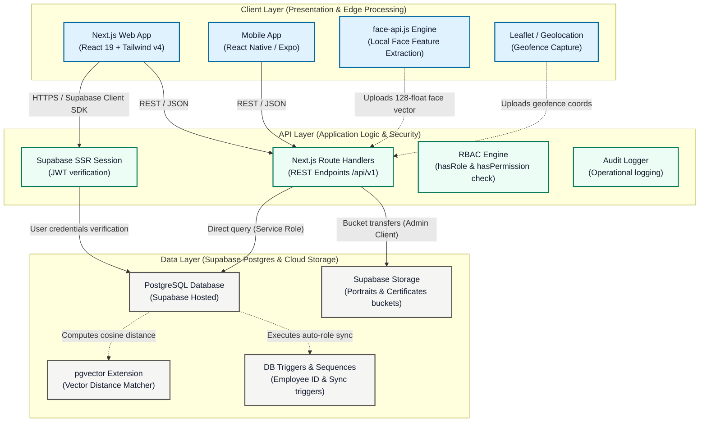

# System Architecture — 3 Tiers

An architectural overview of the **Upasthiti** software stack, organized into three distinct tiers: **Client Layer (Presentation & Edge Processing)**, **API Layer (Application Logic & Auth Middleware)**, and **Data Layer (Supabase Postgres & Cloud Storage)**.

---

## 1. System Architecture Diagram



---

## 2. Tier Details & Component Mapping

### A. Client Layer (Presentation & Edge Processing)
The Client Layer provides the visual interface and coordinates edge computing capabilities to offload computation from the backend.

*   **Next.js Web App (`apps/web`):** Built using Next.js App Router (React 19) and styled with Tailwind CSS (v4). Serves role-specific dashboards for Admins, Coaches, and Students. Uses server cookies managed by `@supabase/ssr` to persist user sessions.
*   **Expo Mobile App (`apps/mobile`):** React Native client deployed using Expo. Contains built-in camera, storage, and AV dependencies to perform mobile check-ins and attendance updates.
*   **Edge Biometrics (`face-api.js`):** Client-side face detection module. When taking portrait enrollments or auto-attendance scans, `face-api.js` is dynamically imported to run local feature mapping via SSD MobileNet. It outputs a **128-dimensional face embedding array (vector)** directly on the client, minimizing backend CPU consumption.
*   **Leaflet Maps & Geolocation:** Geolocation APIs capture user coordinates during check-ins, allowing the UI to cross-reference them with configured geofences on Leaflet maps.

---

### B. API Layer (Application Logic & Security)
The API Layer acts as the gatekeeper and orchestrator of application logic, handling authentication, authorization, and business rules.

*   **Next.js Route Handlers (`/app/api/v1/`):** REST API endpoints that execute operations such as enrollment, batch management, document processing, leaves filing, and fine collection.
*   **Supabase SSR Auth:** Evaluates incoming request cookies on the server, decoding JWT headers to verify the caller's identity securely.
*   **RBAC Middleware (`hasRole`/`hasPermission`):** Decouples access control from specific endpoints. Restricts access to student, coach, admin, and superadmin modules. Coaches without an `Active` status (e.g. `Onboarding`, `Document Upload Pending`, `Pending Verification`) are systematically blocked from admin and batch activities.
*   **Audit Logging (`logAuditEvent`):** Log helper that asynchronously logs audit events directly to the `audit_logs` table for compliance.

---

### C. Data Layer (Persistence, Vector Match, & Storage)
The Data Layer persists the application's transactional records, binary files, and face embeddings.

*   **Hosted PostgreSQL (Supabase):** The primary relational database containing schemas for `users`, `coaches`, `students`, `batches`, `attendance`, `leaves`, `fines`, and `audit_logs`.
*   **`pgvector` Extension:** Stores face embeddings in a dedicated vector column in the `student_face_samples` table. Matches faces via cosine or L2 Euclidean distance directly inside query operations.
*   **Database Triggers & Sequences:**
    *   `trg_coaches_employee_id` / `generate_coach_employee_id()`: Generates sequential coach identifiers starting with `COACH1029`.
    *   `auth.users` Sync Trigger: Creates user records in `public.users` with the `student` role instantly on registration.
*   **Supabase Storage:** S3-compatible cloud buckets:
    *   `student-portraits/`: Reference photos for biometric enrollment.
    *   `coach-certificates/`: Uploaded onboarding credentials (Aadhaar, PAN, resumes).
    *   `avatars/`: Profile photos for coaches and students.

---

## 3. Key Core Workflows

### 1. Passwordless Authentication & Provisioning
```
[User Login] ──> [Google OAuth or Magic Link OTP] ──> [auth.users Created]
                                                             │
                                                     (Trigger fired)
                                                             │
                                                             ▼
                                                [public.users Auto-Sync]
                                                (Default: Student role)
```

### 2. Biometric Face Match & Auto-Attendance
```
[Group Photo Upload] ──> [face-api.js Edge Scan] ──> [Extract 128-float Embedding]
                                                                  │
                                                          (POST API Request)
                                                                  │
                                                                  ▼
[Mark Attendance] <── [Verify Vector Match (pgvector)] <── [Match Face API Route]
```
