# Feature Plan: Upasthiti AI-Powered Attendance & Student Progress Platform

Upasthiti is an AI-powered SaaS platform designed for coaching centers, schools, sports academies, tuition centers, and martial arts institutes. It starts as a high-precision attendance system and evolves into a holistic student progress, sports performance, and health-tracking ecosystem.

This document defines the functional features, user roles, interaction workflows, core modules, and detailed application screens.

---

## 1. User Roles & Capabilities

Upasthiti supports a multi-tenant, multi-role structure. Each role is tailored to its specific user experience.

### A. Superadmin (SaaS Platform Owner)
*   **Tenant Administration:** Onboard new coaching centers, schools, or academies. Monitor subscription plans (trial, active, suspended).
*   **Global Analytics:** View system-wide metrics (total active tenants, platform-wide attendance averages, platform billing).
*   **System Controls:** Configure global AI feature access, system-wide rate-limits, and compliance settings.

### B. Admin (Institute Manager / Coach / Teacher)
*   **Student & Profile Onboarding:** Create, update, and suspend student accounts. Configure individual profile details (address, joining dates, customized identifiers).
*   **Face Sample Enrollment:** Manage a student's facial profile by uploading multiple face samples (front, side profiles, varying lighting conditions) to train the edge AI.
*   **Class & Batch Control:** 
    *   Create classes (e.g., "Intermediate Swimming", "Advanced Karate").
    *   Map classes to batches with defined timings (start time, end time), weekly schedules, and maximum capacity.
*   **Customizable Attendance Rules:**
    *   Set grace periods (e.g., "Students have 10 minutes from batch start before being flagged late").
    *   Set late thresholds ("If arrival is > 5 minutes after start, apply custom rules or mark absent").
    *   Set holiday calendars and designated weekends.
*   **Fines Configuration:** Define fine structures for absences and late arrivals (e.g., "Absent Fine Rule 1: ₹1,000 for up to 4 absences; Rule 2: ₹2,000 for 5+ absences").
*   **Health & Sports Parametrization:** Define custom tracking metrics based on the institute's specialty (e.g., "50m swimming timing" for swimming centers, "flexibility test" for yoga, "strength index" for gymnastics).
*   **AI Review Panel:** Approve or override ambiguous face recognition matches flagged with low confidence levels.
*   **Payment Verification Queue:** Review submitted student payment proofs (screenshots, transaction IDs, cash handovers), approve them (marking ledgers `Paid`), or reject them with custom reasons (marking ledgers `Unpaid` and triggering alerts).
*   **Reporting & Exports:** Generate and download daily, weekly, or monthly attendance sheets and fine summaries in PDF, Excel, and CSV formats.

### C. Student
*   **Personal Dashboard:** View current attendance percentages, batch schedules, and class progress.
*   **Fines Ledger:** Track pending, paid, and **pending verification** fines, with detailed historical reasons.
*   **Submit Proof of Payment:** Upload screenshots of UPI/Bank transfer receipts, input transaction reference numbers, select payment methods, and submit for verification.
*   **Sports & Vitals Tracking:** View historical physical records (height, weight, body measurements, BMI trends) visualized through interactive growth and fitness charts.
*   **Medical Chronology:** Access private uploads of personal medical history, prescriptions, and physiotherapy files.
*   **AI Progress Engine:** View monthly synthesized progress reports summarizing fitness achievements, sports performance improvements, and AI recommendations.

### D. Parent
*   **Child Progress Portal:** Access all dashboards of their linked children (supporting multi-child mapping for families).
*   **Instant Alert Center:** Receive real-time push, email, or SMS notifications when their child is flagged absent, arrives late, incurs a fine, or has a payment proof rejected.
*   **Submit/Review Payments:** Upload receipt screenshots and transaction IDs on behalf of their child to clear pending ledgers.
*   **Medical Vitals Oversight:** Monitor growth trends, allergy logs, and critical clinical anomalies.
*   **AI Pediatric/Coaching Insights:** View automated AI recommendations tailored to their child's health status (e.g., nutrition recommendations for iron deficiency, performance tips to improve stamina).

---

## 2. Core Functional Modules

```mermaid
graph TD
    Root["Upasthiti Features"]
    
    Attendance["Attendance Management"]
    Fines["Rules & Financial Fines"]
    Sports["Sports & Health Analytics"]
    Medical["Medical Vault"]
    AIDiag["AI Progress Engine"]
    Comms["Communication Matrix"]
    
    Root --> Attendance
    Root --> Fines
    Root --> Sports
    Root --> Medical
    Root --> AIDiag
    Root --> Comms
    
    Attendance --> Att1["Photo upload scanner"]
    Attendance --> Att2["Video frame extractor"]
    Attendance --> Att3["Live camera streaming"]
    Attendance --> Att4["Manual override panel"]
    
    Fines --> Fin1["Absence auto-penalties"]
    Fines --> Fin2["Late arrival calculations"]
    Fines --> Fin3["Proof of Payment upload workflow"]
    Fines --> Fin4["Fine settlement ledger & Admin verification"]
    
    Sports --> Spo1["Vitals & BMI tracking"]
    Sports --> Spo2["Stamina & strength scores"]
    Sports --> Spo3["Sport-specific timers"]
    Sports --> Spo4["Growth & fitness charts"]
    
    Medical --> Med1["Encrypted clinical uploads"]
    Medical --> Med2["Blood report metadata"]
    Medical --> Med3["Chronological scans"]
    
    AIDiag --> AI1["Multi-source correlation"]
    AIDiag --> AI2["Vitamin deficiency alerts"]
    AIDiag --> AI3["Personalized suggestions"]
    AIDiag --> AI4["Monthly summaries"]
    
    Comms --> Com1["Expo push alerts"]
    Comms --> Com2["Resend emails"]
    Comms --> Com3["WhatsApp notifications"]
```



### Module 1: AI Attendance Logging Engine
Designed to record attendance across three execution pipelines:

*   **A) Photo Upload Ingestion:**
    *   **Group Scan:** Admin takes a photo of an entire classroom/batch. The AI detects multiple faces, crops them, matches them against the batch database, and checks in all recognized students simultaneously.
    *   **Individual Scan:** A single photo of a student taken at the entrance registers their arrival.
*   **B) Video Ingestion Pipeline:**
    *   Admin uploads a video of a batch entry (e.g., a 15-second clip of students walking into an academy).
    *   The system extracts frames, isolates facial vectors, filters duplicates, and checks in students with recorded arrival timestamps.
*   **C) Live Stream Attendance:**
    *   Admin mounts a mobile device or connects a webcam/CCTV feed at the gate.
    *   The application streams live frames, processes matches on-device or via edge endpoints, and logs check-ins in real-time.
*   **Ambiguity Handlers:**
    *   **Low Light/Blur Detection:** If a match's confidence score falls below a threshold (e.g., 65%), the system registers a "Pending Admin Review" log.
    *   **Duplicate Safeguards:** Multiple scans of the same face within the same batch window do not trigger multiple check-ins.

### Module 2: Rules & Financial Fines Engine
Allows institutes to automate administrative policies and track payments efficiently:

*   **Automated Absence Fines:**
    *   *Default System Rules:* 
        *   ₹1,000 fine for each absent day up to 4 days per month.
        *   ₹2,000 fine per absent day starting from the 5th absence.
    *   Fines are automatically compiled and billed to the student ledger at the end of the day or immediately upon absence validation.
*   **Late Policy Enforcement:**
    *   *Late Rule:* If a student checks in after the configured grace period (e.g., 5 mins), the system can automatically flag them as "Absent" and trigger the corresponding fine, or mark them "Late" with a minor penalty.
*   **Exemptions Registry:**
    *   Fines are skipped on days marked on the institute's holiday calendar or weekends.
    *   Admins can waive fines with documented reason logs (e.g., medical leave).
*   **Proof of Payment Workflow (Receipts & Screenshots):**
    *   When a fine is issued, students/parents can clear it either via automated gateways (if active) or via **Manual Upload (UPI, Bank Transfer, Cash)**.
    *   **Student Action:** Upload a screenshot of the payment receipt, input the payment method (UPI, Bank, Cash), and type the transaction ID/reference number.
    *   **Status Lifecycle:** The fine status changes from `Unpaid` to `Pending Verification`.
    *   **Admin Verification Panel:** Admins are notified of new submissions. They cross-reference the screenshot/transaction ID with their bank ledger.
    *   **Outcome Actions:**
        *   *Approve:* Changes ledger to `Paid`, records payment timestamp, and closes the fine.
        *   *Reject:* Changes ledger back to `Unpaid`, marks the proof as `Rejected`, logs a rejection reason (e.g., "Transaction ID not found in bank records"), and triggers an instant notification to the parent.

### Module 3: Sports Vitals & Performance Analytics
Tracks a student's physical and athletic progression over time:

*   **Routine Vitals:** Log height, weight, resting heart rate, blood pressure, BMI, body fat %, and muscle mass.
*   **General Performance Metrics:** Compute scores for strength (e.g., reps), flexibility (e.g., reach test), and endurance (e.g., VO2 Max).
*   **Sport-Specific Timers:** Log performance parameters like 50m swimming times, 100m sprint times, vertical jump heights, or martial arts kata execution rankings.
*   **Interactive Visualizations:** Renders historical graphs showing fitness trends, weight tracking, and performance curves.

### Module 4: Secure Medical Vault
A secure clinical records depository for sensitive files:

*   **File Formats:** Supports PDF uploads, blood test reports, clinical scan images (X-rays, MRIs), prescriptions, nutrition guides, and physiotherapy notes.
*   **Chronological Ordering:** Files are arranged in a timeline view, displaying the dates when reports were recorded.
*   **Granular Access Control:** Data privacy settings ensure only the student, parents, and authorized coaches/admins can view files.

### Module 5: AI Progress Engine
An AI engine (using Gemini Flash) that cross-analyzes attendance records, sports performance timers, and medical vault uploads to generate structured reports:

*   **Multi-Source Data Correlation:** Matches physical changes with attendance and medical records. 
    *   *Example analysis:* Cross-references weight gain or stamina drops with rising liver enzymes or vitamin deficits found in uploaded blood reports.
*   **Automated Deficiency & Risk Spotting:** Flags potential issues, such as iron/vitamin deficits, fatigue risks, or signs of physical overtraining.
*   **Monthly Progress Summaries:** Generates personalized reports for parents and coaches (e.g., *"Weight increased from 42kg to 46kg. Swimming times improved by 10%. Stamina trends show steady recovery. Iron indices show signs of depletion; recommended dietary adjustments provided."*).
*   **Actionable Recommendations:** Generates customized nutrition guides, recovery exercises, and training adjustments.

### Module 6: Multi-Channel Communication Matrix
Ensures stakeholders receive timely alerts and actionable digests directly where they are active:

*   **Instant Notifications:** Triggered for critical events:
    *   **Instant WhatsApp Absence Alerts:** Pushed automatically to the registered WhatsApp numbers of parents and students within 5 minutes of a batch check-in deadline if the student is marked absent.
        *   *Message Template:* `Dear Parent, Arjun was flagged ABSENT for batch "Pro Swimming" today (21-May at 09:00 AM). A default fine of ₹1,000 has been added to your ledger. Settle it or upload proof of payment: https://upasthiti.app/ledger/f-uuid`
    *   **System Action alerts:** Payment proof approvals/rejections, late arrivals, and newly configured fine alerts.
*   **Scheduled Digests:**
    *   **Monthly WhatsApp Ledger Digests:** Automatically compiled at the end of every calendar month and pushed to the student's and parent's WhatsApp accounts.
        *   *Digest Template:*
            ```text
            *Upasthiti Monthly Progress & Ledger Digest - May 2026*
            -------------------------------------------------
            Student: Arjun Sharma | Batch: Pro Swimming
            
            📊 Attendance Summary:
            - Present: 22 days | Absent: 4 days | Late: 1 day
            - Current Attendance Avg: 84.6%
            
            💰 Financial Summary:
            - Total Fines Accrued: ₹4,000
            - Paid / Verified: ₹3,000
            - Outstanding Balance: ₹1,000 (1 Pending Verification)
            
            🔗 Click here to view full health curves, medical history and clear outstanding dues: https://upasthiti.app/dashboard/s-uuid
            ```
*   **Delivery Channels:**
    *   *WhatsApp Gateway (Meta Business API / Twilio / Wati / Aisensy):* Delivers rich-text templates with interactive quick-reply CTA buttons (e.g., `[Pay Dues]` or `[Upload Receipt]`) to parents' and students' phones.
    *   *Expo Native Push Notifications:* Real-time, interactive push notifications sent to student and parent mobile apps.
    *   *Transactional Emails (Resend):* Rich HTML reports sent to parent and student email addresses.

---

## 3. Core Workflows & User Journeys

### A. The Morning Attendance Scan (Admin Ingestion)
1.  Admin opens the **Upasthiti Mobile App** and navigates to the **Batch Attendance Scanner**.
2.  Selects the batch "9:00 AM Pro Swimming".
3.  Mounts the phone at the entry gate on a stand.
4.  As students arrive, the camera detects their faces locally.
5.  A high-speed frame processor extracts vectors and matches them in milliseconds against the enrolled batch list.
6.  The device screen displays a green checkmark, the student's name, and a confirmation sound.
7.  If an unrecognized student walks past, the screen flags an **"Unknown Face Detected"** alert. Admin can manually assign them or register a guest profile.

### B. Parent Alert & Action Workflow
1.  A student is marked absent for their 9:00 AM batch.
2.  At 9:05 AM (after the grace period), the server-side rules engine triggers a notification.
3.  The parent receives a mobile push notification: *"Alert: Arjun was absent for Swimming at 9:00 AM. A fine of ₹1,000 has been added to your ledger."*
4.  Parent taps the notification to open the **Upasthiti Mobile App**.
5.  Parent reviews the alert, views the active fine ledger, and can tap **"Upload Medical Exemption"** or **"Pay Fine"** to settle it instantly.

### C. Manual Payment Verification Journey
1.  A parent makes a manual UPI transfer of ₹1,000 to the academy's QR code displayed at the pool.
2.  The parent opens the **Upasthiti Mobile App**, clicks on the Arjun's active fine, and taps **"Submit Payment Proof"**.
3.  The parent inputs the transaction reference number `UPI123456789`, attaches a screenshot of the payment confirmation screen from their phone gallery, and submits.
4.  Arjun's fine status instantly changes to **`Pending Verification`**.
5.  At the end of the day, the Academy Admin opens the **Admin Web Dashboard** and clicks on **"Payment Queue (1 Pending)"**.
6.  Admin views the attached screenshot alongside the transaction ID `UPI123456789`, cross-references it with their online banking panel, and verifies the funds arrived.
7.  Admin clicks **"Approve Payment"**.
8.  The ledger updates to `Paid`. Arjun's dashboard updates, and the parent receives an instant alert: *"Payment of ₹1,000 for Swimming Fine on 18-May has been successfully verified. Thank you."*

---

## 4. Application Screen Specifications

Here are the detailed UI structures and interactive layouts for both the administrative web portal and mobile app dashboards.

### A. Admin Web Dashboard (SaaS Portal)
*   **Purpose:** The control center for institute owners and administrative staff. It displays operational vitals, pending anomalies, and the payment verification queue.
*   **Layout Structure:** Modern sidebar layout with responsive structural panels.
    *   **Sidebar Navigation:** Dashboard | Classes & Batches | Students Ledger | Health & Sports Vault | Financial Fines | **Payment Queue [1]** | AI Audit Logs | Portal Settings
    *   **Header Panel:** Multi-tenant profile selector, dynamic notification bell, active system system-health status indicator.
*   **Mock Wireframe:**
```
========================================================================================
 [UPASTHITI ADMIN]             Active Batch: 09:00 AM Swimming Pro  [Tenant: Elite Academy]
----------------------------------------------------------------------------------------
 [x] Dashboard       | [ Present Today ]  [ Absent Today  ]  [ Pending Fines]  [ Active Payments]
  [  248 / 300    ]  [   52 / 300    ]  [   ₹14,500    ]  [   3 Pending    ]
 [ ] Batches         | -----------------------------------------------------------------
 [ ] Students        |  REAL-TIME ATTENDANCE FEED                PAYMENT VERIFICATION QUEUE
 [ ] Health Tracker  |  [09:04] Arjun S. - Present (98% match)  | [!] Arjun Sharma - ₹1,000
 [ ] Fines & Ledger  |  [09:03] Riya M.  - Present (94% match)  |     Method: UPI | Ref: UPI12345678
 [x] Payment Queue   |  [09:01] Kabir D. - Late (5 min grace)    |     File: [ View Screenshot ]
 [ ] AI Insights     |  [08:59] Diya K.  - Present (99% match)  |     [ APPROVE ]  [ REJECT ]
 [ ] Settings        |
========================================================================================
```
*   **Key Interactive Widgets:**
    *   *KPI Card Grid:* Top cards with colored badges representing daily active parameters. Clicking "Active Payments" redirects directly to the verification pipeline.
    *   *Payment Queue Panel:* Displays a card containing the student's name, payment amount, selected method, input transaction ID, and a clickable thumbnail to view the full-size receipt screenshot. Features instant `Approve` and `Reject` (with a text-box for reasons) buttons.

---

### B. Admin Mobile Camera Scanner (Edge Attendance Device)
*   **Purpose:** The physical scanner app used on tablets or phones mounted at the gate.
*   **Layout Structure:** Immersive fullscreen camera interface with a semi-transparent bottom status panel.
*   **Mock Wireframe:**
```
+-------------------------------------------------------------+
| [CCTV / CAMERA LIVE FEED]                     [FPS: 30] [x] |
|                                                             |
|           /---------------------------------\               |
|          |    [  Face In Focus Bounding ]    |              |
|          |    [       98.4% Match           ]    |              |
|          |    [  Arjun Sharma - Checked In  ]    |              |
|           \---------------------------------/               |
|                                                             |
|                                                             |
+-------------------------------------------------------------+
| MATCH LOGS (Swipe Up to Expand)                             |
|  [Checked In] Arjun Sharma    - 9:02 AM - Pro Swimmers      |
|  [Checked In] Diya Sen        - 9:01 AM - Intermediate      |
|  [!] UNKNOWN FACE DETECTED    - 8:59 AM - [ RE-SCAN ] [ADD] |
+-------------------------------------------------------------+
```
*   **Key UI Elements:**
    *   *Dynamic Bounding Boxes:* Draws colored circles/rectangles around detected faces in real time. Colors represent match confidence (Green: >75%, Orange: 60-75% Review, Red: Unknown).
    *   *Instant Verification HUD:* Slides a transient overlay indicating status (e.g., green checkmark for successful match, orange alert for "Late Arriving", red cross for "Access Denied").

---

### C. Student Mobile Dashboard
*   **Purpose:** The primary mobile view for students, showing summaries of their attendance, finances, and personal athletic metrics.
*   **Layout Structure:** Modern card-based UI with fluid sliding grids.
*   **Mock Wireframe:**
```
+-------------------------------------------------------------+
|  [Student Profile Card]  Arjun Sharma                       |
|  Batch: 09:00 AM Pro Swimming | Join Date: 12-Jan-2026       |
+-------------------------------------------------------------+
|  ATTENDANCE REGISTER        |  FINANCIAL LEDGER             |
|    Monthly Target: 90%      |    Pending Fines: ₹1,000      |
|    Current Avg:    [ 94% ]  |    Last Fine: Absent (18-May) |
|    [ View History Calendar] |    [ SUBMIT PROOF ] [ PAY ]   |
+-------------------------------------------------------------+
|  SPORTS & VITALS TRACKING (Last 30 Days)                    |
|    Weight: 42kg -> 46kg (Stable)                            |
|    Stamina Score: [=======....] 72/100 (+5%)                |
|    [ View Performance Curves & Fitness Charts ]             |
+-------------------------------------------------------------+
|  AI INSIGHTS REPORT (May 2026)                              |
|    "Your stamina score improved by 5%. However, iron logs   |
|     indicate potential fatigue risk. Read suggestions..."   |
+-------------------------------------------------------------+
```
*   **Key UI Components:**
    *   *Attendance Progress Circle:* A circular progress chart showing the monthly target vs. actual attendance percentage.
    *   *Fines Alert Widget:* Highlighted in amber if a fine is pending. Clicking **"Submit Proof"** opens a modal interface allowing the student to select a payment method, input the transaction reference ID, and attach an image screenshot of the receipt.

---

### D. Parent Portal (Multi-Child View)
*   **Purpose:** Allows parents to monitor attendance and health metrics for all their children from a unified screen.
*   **Layout Structure:** Sibling tab bar navigation on top, leading to detailed health and dashboard cards.
*   **Mock Wireframe:**
```
+-------------------------------------------------------------+
|  [ Tab Bar ]   [ ARJUN SHARMA ]    [ RIYA SHARMA (Sister) ] |
+-------------------------------------------------------------+
|  DAILY CHECK-IN STATUS                                      |
|    Status Today: Checked In (09:02 AM)                      |
|    Mode: Live Camera Scanner (Elite Academy Gate 1)         |
+-------------------------------------------------------------+
|  HEALTH & MEDICAL VAULT OVERVIEW                            |
|    Vitals Level: [ NORMAL ]     Risk Index: [ LOW ]         |
|    [+] Upload Doctor Note / Medical Exemption               |
+-------------------------------------------------------------+
|  DAILY ACTIONS SUMMARY                                      |
|    Arjun's Ledger: ₹1,000 [ Pending Verification ]          |
|    Ref: UPI12345678 | Submitted: 21-May 07:32 PM            |
|    [ Review Attached Proof ]   [ Settle via Alternate ]     |
+-------------------------------------------------------------+
```
*   **Key UI Components:**
    *   *Multi-Child Switcher:* A dynamic top tab-bar. Selecting a sibling re-renders all data cards beneath it.
    *   *Finance Actions Segment:* Specifically details the current status of fine settlements. Shows confirmation if proof is currently pending review by the academy admin, reducing anxiety about automated fine accruals.

---

## 5. Future AI Roadmap & Extensibility

Upasthiti is designed to expand into a comprehensive SaaS sports and student intelligence suite:

*   **AI Coach & Conversational Chatbot:** An interactive assistant for students and parents to ask questions like, *"How can I improve my 50m freestyle time based on my recent progress?"* or *"What is my current pending fine balance?"*
*   **Injury Prediction Engine:** Machine learning models that cross-reference vitals, flexibility scores, and rapid stamina drops with training volume to flag high injury risks before they occur.
*   **Voice-Activated Attendance:** Offline audio processing models matching student voice signatures at check-in.
*   **Geofenced QR-Codes:** Secure, location-locked dynamic QR codes displayed at classrooms/fields that students can scan using their mobile apps to check in automatically.
*   **Nutrition and Diet AI Generator:** Generates automated, customized meal plans based on active training logs and uploaded blood panels.
